# END-to-END-Azure-Data-Engineer-project
My Azure Data Engineer END to END Project

# Azure End-to-End Data Engineering Project: Car Sales Analytics

## 🎯 Project Overview
This project demonstrates a complete data engineering pipeline on Azure Cloud, processing car sales data through a medallion architecture with incremental loading capabilities.

## 🏗️ Architecture

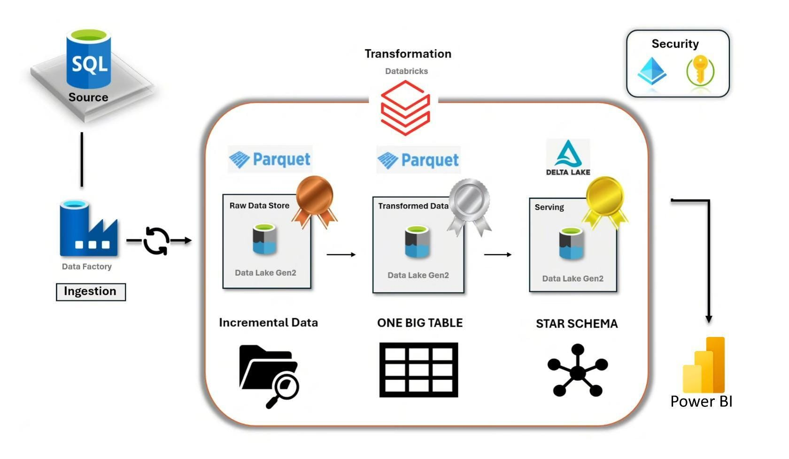
*High-level architecture of the data pipeline*

### 1. Resource Groups and Azure Resources

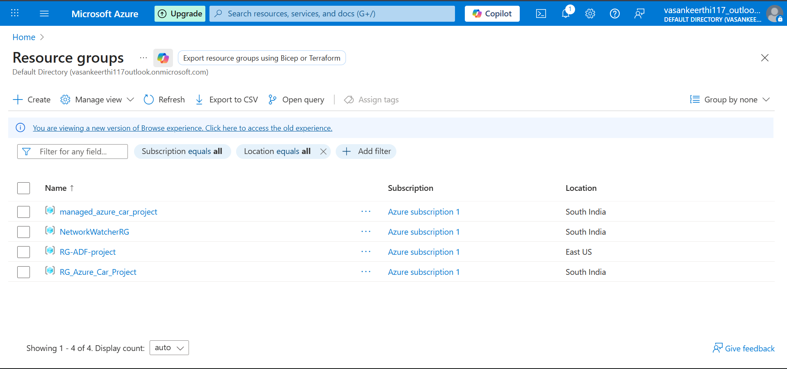
*Azure Resource Groups containing all project resources*

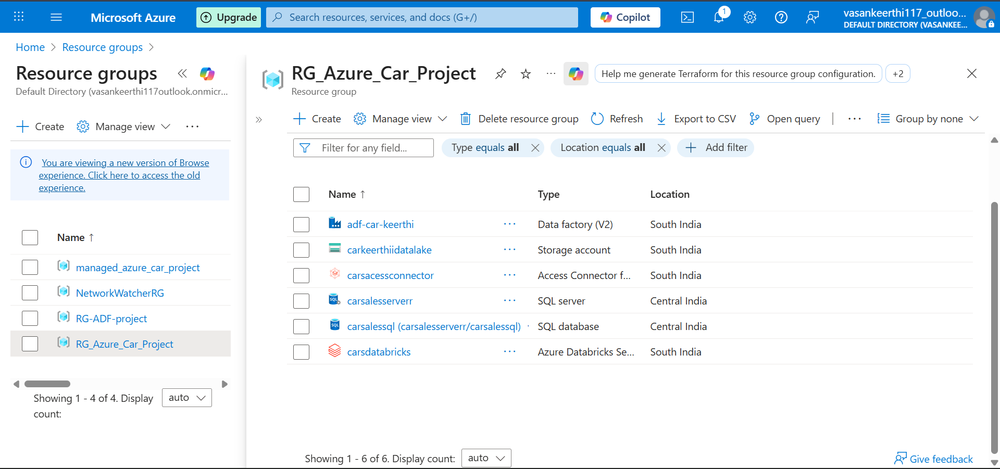
*Detailed view of resources in RG_Azure_Car_Project*

### 2. Azure Data Factory Pipelines

#### Source Preparation Pipeline
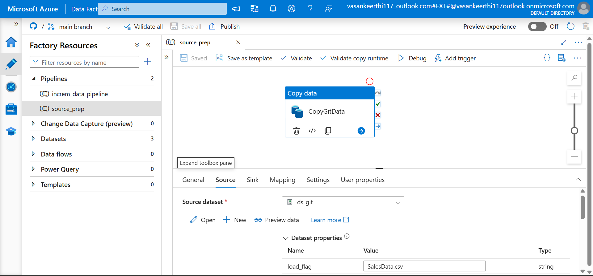
*source_prep pipeline - Initial data extraction from Git to Bronze layer*

#### Incremental Data Pipeline
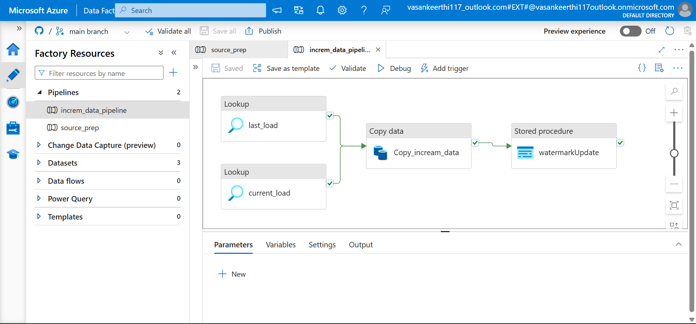
*increm_data_pipeline - Watermark-based incremental loading*

### 3. Azure Data Lake Storage

#### Container Structure
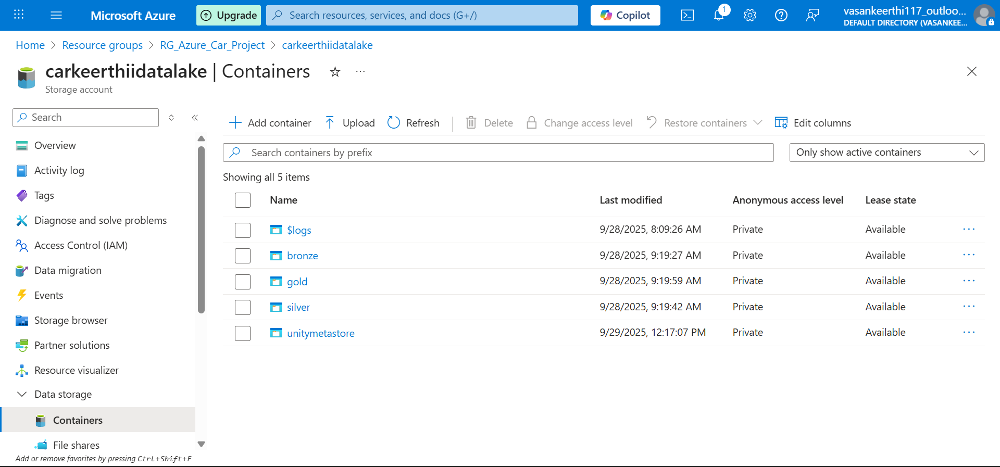
*ADLS containers: bronze, silver, gold, and unitymetastore*

#### Gold Layer Dimensional Model
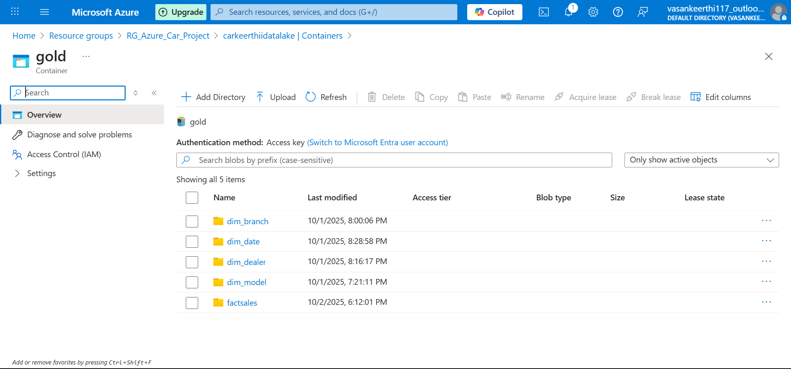
*Gold layer containing dimensional tables and fact table*

### 4. Azure SQL Database

#### Query Editor
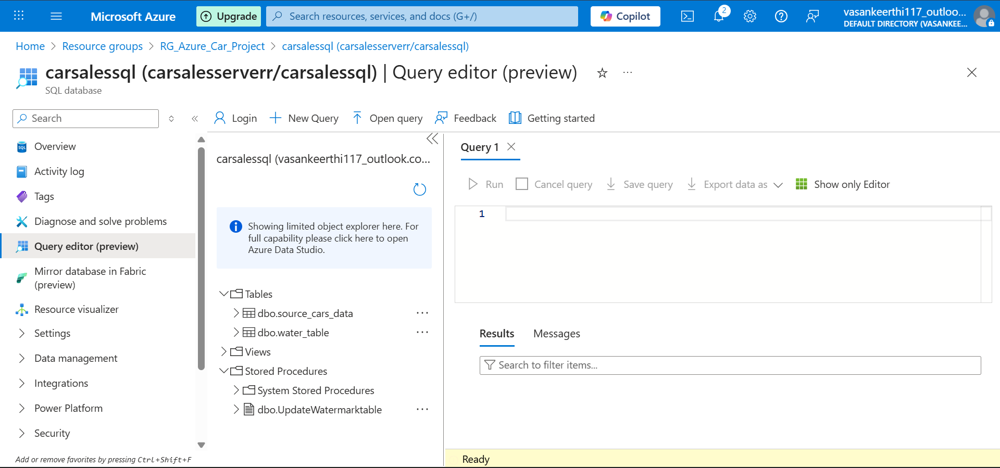
*SQL Database with water_table for watermark management*

#### Stored Procedure
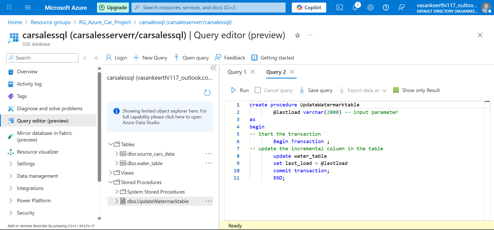
*UpdateWatermarktable stored procedure for incremental loading*

### 5. Azure Databricks Integration

#### Access Connector
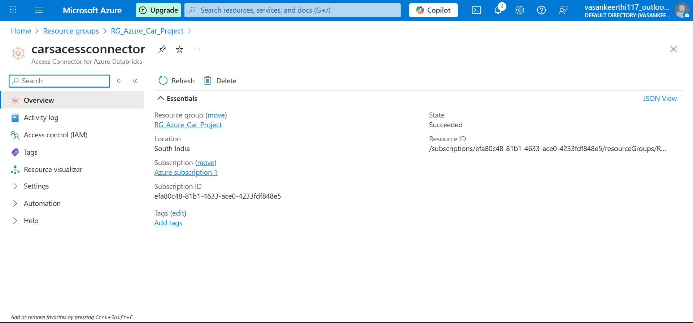
*Access Connector for Azure Databricks authentication*

#### Databricks Notebooks
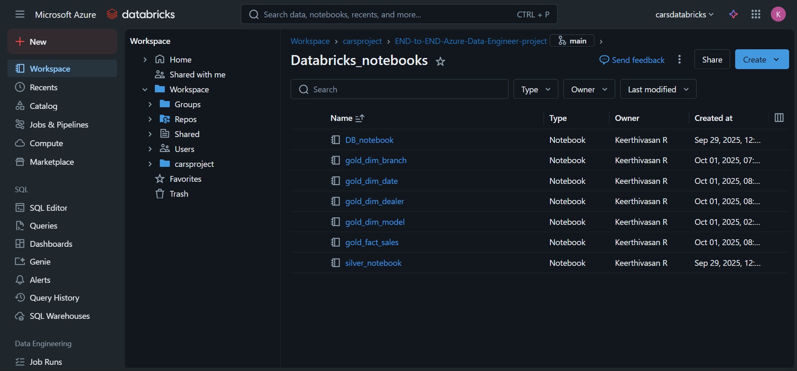
*Databricks notebooks for dimensional modeling and transformations*

### 6. Pipeline Execution Results

#### Job Run Details
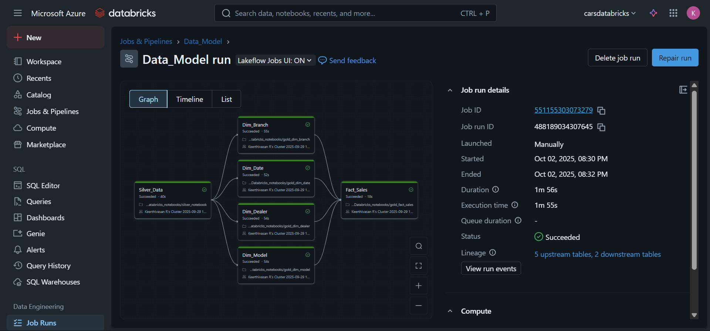
*Successful job execution with lineage information*

#### Job Run Graph
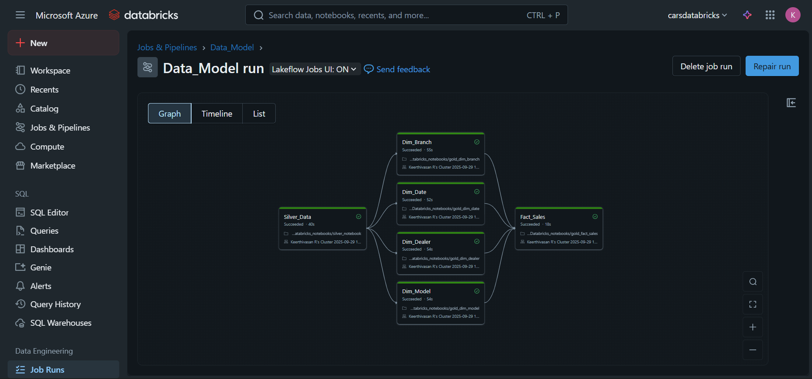

### Data Flow
1. **Source Layer**: CSV files stored in Git repository
2. **Bronze Layer**: Raw data ingestion into Azure Data Lake Storage
3. **Silver Layer**: Cleaned and validated data
4. **Gold Layer**: Business-ready dimensional model
5. **Consumption**: Analytics-ready star schema

### Azure Services Used
- **Azure Data Factory**: Orchestration and ETL pipelines
- **Azure Data Lake Storage Gen2**: Data lake with hierarchical namespace
- **Azure Databricks**: Big data processing and transformation
- **Azure SQL Database**: Metadata and watermark management
- **Git**: Version control for datasets

## 📊 Data Model

### Dimension Tables
- `dim_branch`: Branch information
- `dim_date`: Date dimension
- `dim_dealer`: Dealer details
- `dim_model`: Car model information

### Fact Table
- `fact_sales`: Sales transactions

## 🔄 Pipeline Architecture

### 1. Source Preparation Pipeline (`source_prep`)
- **Purpose**: Initial data extraction from Git
- **Components**:
  - CopyGitData activity
  - Source dataset: `ds_git`
  - Sink: Azure Data Lake (Bronze container)

### 2. Incremental Data Pipeline (`increm_data_pipeline`)
- **Purpose**: Process only changed/new records
- **Components**:
  - Lookup activities (`last_load`, `current_load`)
  - Copy activity for incremental data
  - Stored procedure activity (`watermarkUpdate`)

## 🗂️ Storage Structure

## 💾 Database Components

### Azure SQL Database: `carsalessql`
- **Table**: `water_table` (tracking last processed records)
- **Stored Procedure**: `UpdateWatermarktable`
  - Input parameter: `@lastload varchar(2000)`
  - Purpose: Update watermark for incremental loading

## 📓 Databricks Notebooks

Located in workspace: `Databricks_notebooks/`
- `gold_dim_branch`
- `gold_dim_date`
- `gold_dim_dealer`
- `gold_dim_model`
- `gold_fact_sales`
- `DB_notebook`
- `silver_notebook`

## 🔐 Security & Access

- **Access Connector**: `carsacessconnector` for Azure Databricks
- **Resource Group**: `RG_Azure_Car_Project`
- **Location**: South India (primary), Central India (SQL)
- **Subscription**: Azure subscription 1

## 📈 Performance Metrics

- **Pipeline Execution Time**: ~1-2 minutes
- **Data Processing**: Successfully processed dimensional and fact tables
- **Job Status**: All tasks completed successfully

## 🚀 Key Features

1. **Incremental Loading**: Watermark-based approach to process only new/changed data
2. **Medallion Architecture**: Bronze → Silver → Gold layer progression
3. **Dimensional Modeling**: Star schema for analytics
4. **Version Control**: Git integration for pipeline configurations
5. **Scalability**: Cloud-native architecture supporting growing data volumes

## 📝 Prerequisites

- Azure Subscription
- Azure Data Factory
- Azure Data Lake Storage Gen2 account
- Azure Databricks workspace
- Azure SQL Database
- Git repository access

## 🛠️ Setup Instructions

1. Create resource group in Azure
2. Deploy Azure Data Lake Storage account
3. Set up Azure Data Factory
4. Configure Azure Databricks workspace
5. Create Azure SQL Database with watermark table
6. Deploy Access Connector for Databricks
7. Import notebooks into Databricks
8. Configure linked services in ADF
9. Deploy pipelines and datasets

## 📊 Monitoring

- Pipeline runs can be monitored through Azure Data Factory UI
- Databricks job runs visible in Jobs & Pipelines section
- SQL watermark table tracks processing timestamps

## 👤 Author

Keerthivasan R

## 📄 License

This project is for demonstration purposes.
